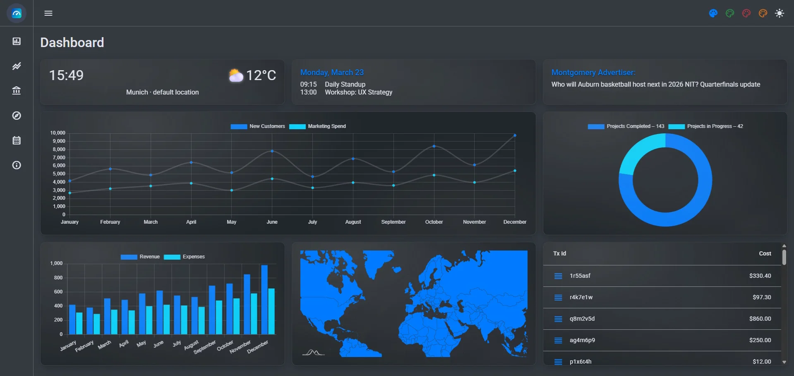
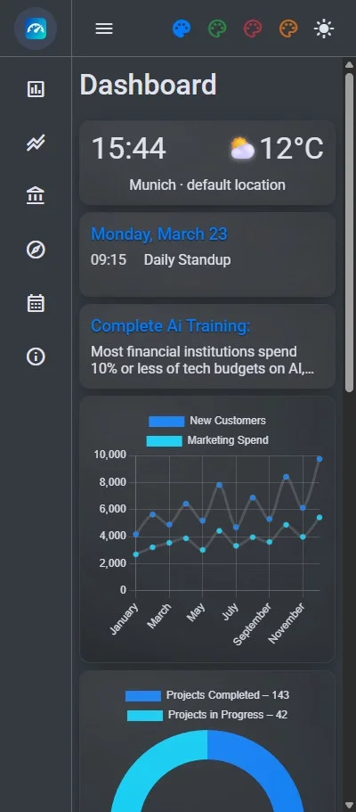

[](https://angular.dev/)
[](https://material.angular.io/)
[](https://www.mysql.com/)
[](https://www.php.net/)
[](#-technical-implementation)
[](https://rxjs.dev/)
[](https://sass-lang.com/)
[](https://www.typescriptlang.org/)

<div>
    
    
</div>

# Business Dashboard

> **Developer Note:** This application was designed to demonstrate my proficiency in building modern, data-driven web interfaces using Angular. More than just a visual demo, this project reflects my approach to software development: creating clean, intuitive user experiences backed by robust, component-based architecture.

This project is intentionally frontend-focused and uses static/mock data to highlight UI architecture, performance, and component composition. It features a responsive layout, clear data visualization, and a refined UI tailored for business use cases. As a developer, I focus on writing maintainable code and leveraging the full potential of the Angular ecosystem to solve complex problems.

Explore the app to see my work in action!

## 🛠 Technical Implementation

This project leverages the cutting-edge features of **Angular 20** to deliver a high-performance, maintainable frontend architecture.

### Core Architecture & State

* **Zoneless Change Detection:** Implemented `provideZonelessChangeDetection()` for superior performance and smaller bundle sizes, moving away from traditional Zone.js overhead.
* **Standalone Architecture:** Fully modular design using Angular's latest Standalone Components API.
* **Advanced Routing:** Optimized with `PreloadAllModules` strategy to ensure seamless navigation while keeping initial load times minimal.

### UI & UX Components

* **Responsive Dashboard Layout:** Structured grid-based design for displaying KPIs, metrics, and business data at a glance.
* **Data Visualization:** Interactive charts and metric cards for clear representation of business performance.
* **Custom SCSS Theming:** A consistent, maintainable design system with reusable variables and mixins.

### Engineering Practices

* **Reactive Programming:** Extensive use of **RxJS** for handling asynchronous data streams and state updates.
* **Type Safety:** Built with **TypeScript**, ensuring strict typing and robust code quality across all layers.
* **Code Quality:** Clean code principles with a focus on reusability, separation of concerns, and readability.

### Project Structure

```
src/
├── app/
│   ├── components/         # Reusable UI components
│   ├── pages/              # Main view components (routed)
│   ├── services/           # Data fetching & business logic
│   └── app.routes.ts       # Central routing configuration
├── public/                 # Static assets
├── scripts/                # Utility & build scripts
└── styles/                 # Global styling & SCSS variables
```

---

## ⚙️ Environment Setup

This project connects to a PHP backend via a MySQL database. The backend requires a `.env` file in the **PHP backend root directory** (not tracked by Git).

Create a `.env` file and add the following variables:

```dotenv
DB_HOST=your_database_host
DB_NAME=your_database_name
DB_USER=your_database_user
DB_PASS=your_database_password
```

> **Note:** Never commit the `.env` file to version control. Make sure it is listed in your `.gitignore`.

---

## 🚀 Getting Started

### Prerequisites

* **Node.js:** >= 20.x
* **Angular CLI:** 20.1.x

### Installation

1. Clone the repository:

   ```
   git clone https://github.com/43and18zeroes/business-dashboard
   cd business-dashboard
   ```
2. Install dependencies:

   ```
   npm install
   ```
3. Run the application:

   ```
   npm start
   ```
4. Deploy:

   ```
   npm run build
   ```
